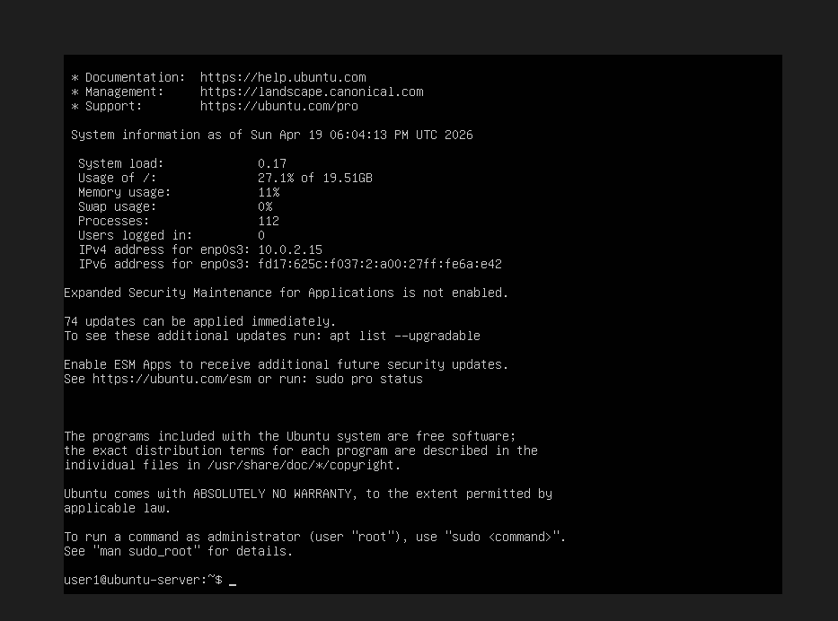
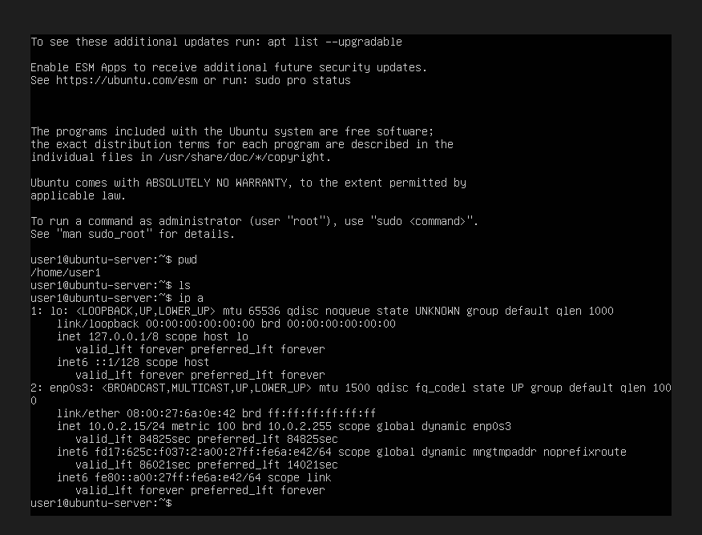

2_Installation_Linux_Ubuntu__Server_via_VM


1. ÉTAPE 1 — Télécharger Linux

On va utiliser Ubuntu car :

facile
utilisé en entreprise
parfait pour apprendre


Télécharger Ubuntu

Aller sur le site officiel et télécharger :

Ubuntu Server LTS


https://ubuntu.com/download/server


Fichier attendu :

ubuntu-22.04.x-live-server-amd64.iso

Pourquoi Server :

plus léger
utilisé en entreprise
parfait pour apprendre l’administration

=> c'est l'ISO


### ATTENTION 
Ubuntu Server 24.04 live-server plante dans VirtualBox

# La solution fiable : installer Ubuntu Server 22.04 LTS
C’est la version LTS stable, supportée jusqu’en 2032, et elle fonctionne parfaitement dans VirtualBox.

Et surtout :  
elle ne plante pas à “Completing installation”.


# Pourquoi 24.04 plante dans VirtualBox ?
L’installateur *Subiquity* de 24.04 a des bugs connus :

- freeze à la fin  
- erreurs de post-installation  
- problèmes réseau  
- incompatibilités VirtualBox  

Canonical travaille dessus, mais ce n’est pas encore réglé.

# Si ON veuT absolument Ubuntu 24.04
On peut contourner le bug en :

- désactivant la carte réseau dans VirtualBox  
- augmentant la RAM à 3 Go  
- mettant le disque et l’ISO en SATA
- désactivant l’accélération 3D

Mais ce n’est pas garanti.


# Donc ici on va 
Installer Ubuntu Server 22.04 LTS =>  stable, fiable, parfait pour VirtualBox.  


2. ÉTAPE 2 — Créer la machine virtuelle

* Dans Oracle VM VirtualBox :

    Cliquer sur : New

    Nom : Ubuntu-Server
    Type : Linux
    Sél° emplacement de sortie des VM
    Version : Ubuntu (64bit)

* Ressources

RAM → 2048 Mo (2 Go) (2 Go suffisent largement)
CPU → 2 cœurs
Disque → 20 Go (VDI, dynamique)

Puis FInish


3. ÉTAPE 3 — Monter l'image ISO

Dans VirtualBox : Settings
Puis : Storage
Dans Controller IDE :
    Cliquer sur Empty
    Puis : Choose a disk file
    Sélectionner : ubuntu-22.04.x-live-server-amd64.iso


4. ÉTAPE 4 — Démarrer la machine

Cliquer sur : Start
Ubuntu va démarrer sur l’ISO.

On arrive sur un écran noir avec menu :

=> Choisir :

    “Try or Install Ubuntu Server” 


5. ÉTAPE 5 — Installation Ubuntu

Choisir : Install Ubuntu Server
Langue :choisir English
    (c’est plus simple pour les commandes Linux)
Clavier : French ou dans mon cas english car j'utilise un clavier qwerty

Installation type : Ubuntu Server

Réseau (très important): Ubuntu va configurer automatiquement l’IP via DHCP.
    On peut laisser automatique.
    Il va détecter automatiquement (eth0 ou enp0s3)
        => Laisser en :
            DHCP automatique
    Donc ne touche à rien → continuer

Proxy
    Laisser vide → continuer

Mirror (serveurs Ubuntu)
    Laisser par défaut → continuer

Partition disque (IMPORTANT)
    Choisir :
        Use an entire disk
    Puis :
        sélectionner notre disque
    Ensuite :
        Done
    puis 
        Continue
    => Il va dire :
        “Write changes to disk ?”
    Cliquer :
        Yes

Création utilisateur
    Créer un utilisateur.
    Exemple :
        Name : user
        Server name : ubuntu-server
        Username : user1
        Password : user123
        Confirm Password : user123

Packages
    Quand Ubuntu demande d’installer des packages supplémentaires :
    On coche : OpenSSH Server (Install OpenSSH server ?)
        Cela permettra plus tard de se connecter à distance.
=>      SSH (IMPORTANT POUR CYBER)

Snap packages
    Ignorer → continue


Installation


Fin installation (Attendre 2–5 minutes)
Quand c’est fini cliquer : 
    Reboot Now

# IMPORTANT :
enlèver l’ISO si demandé :
VirtualBox va demander d’enlever l’ISO.
Si Ubuntu redémarre encore sur l’installation :
Dans VirtualBox :
    Settings
    Storage
    Remove ISO
si on le voit pas aller dans settings - storage- et cliquer sur empty de !idE de valider en bas
Puis retourner sur la VM et taper enter
si il stagne en bas sur "Reached target Cloud-init target" taper entrer


6. ÉTAPE 6 — Premier démarrage

Quand Ubuntu démarre, on verra : On arrive sur écran noir :

```bash
ubuntu-server login
```

Se Connecter : Taper :
    login c'est notre username : user1
Puis :
    notre password : user123
ATTENTION Normal que rien ne s’affiche quand on tape le mot de passe


quand terminé on tombe sur cet écran :




7. ÉTAPE 7 — Test des premières commandes
(pour utiliser une commande admin (user "root") utiliser les commandes sudo)
voir la commande "man sudo_root" pour des détails

Une fois connecté :

Sur le Bash :
    Taper : pwd
        => /home/user1
    Puis : ls
            => n'affiche rien, c est normal on a rien mis dans nos dossiers et aucun dossier n'est créé
    Puis : ip a
        Cette commande montre l'adresse IP de notre serveur.
        on la trouve au niveau de :
        enp0s3: <BROADCAST,MULTICAST,UP,LOWER_UP>
        inet 10.0.2.15/24

    Points importants :
    Interface réseau : `enp0s3`
    Adresse IP : `10.0.2.15`
    Masque réseau : `/24`
    Type : `dynamic` → donnée automatiquement par DHCP

    Cette IP `10.0.2.15` est celle donnée par VirtualBox en mode NAT.
        Conséquence du mode NAT
        Avec NAT :
            la VM a internet
            mais le PC ne peut pas se connecter directement à la VM (ex : SSH)




