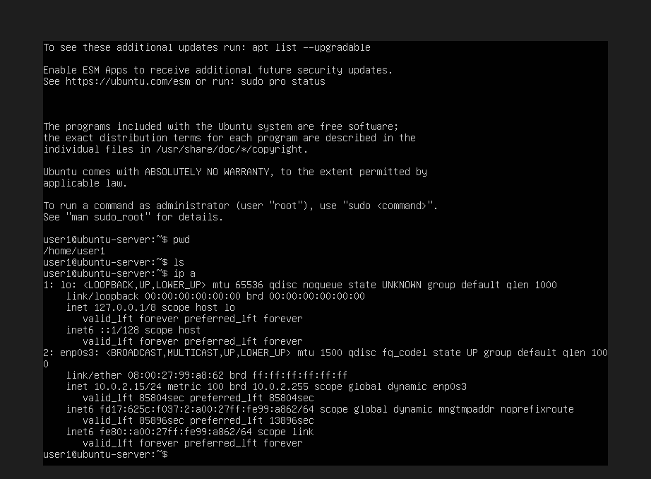

Oui, c’est **normal** 👍. Ton serveur Ubuntu a bien une adresse IP.

Dans ton `ip a`, on voit deux interfaces :

### 1️⃣ `lo` (loopback)

```
1: lo: <LOOPBACK,UP,LOWER_UP>
inet 127.0.0.1/8
```

* C’est l’interface **locale interne**.
* `127.0.0.1` sert à communiquer **avec la machine elle-même**.
* Toutes les machines Linux l’ont.

### 2️⃣ `enp0s3` (ta carte réseau VirtualBox)

```
2: enp0s3: <BROADCAST,MULTICAST,UP,LOWER_UP>
inet 10.0.2.15/24
```

Points importants :

* **Interface réseau** : `enp0s3`
* **Adresse IP** : `10.0.2.15`
* **Masque réseau** : `/24`
* **Type** : `dynamic` → donnée automatiquement par DHCP

Cette IP `10.0.2.15` est **celle donnée par VirtualBox en mode NAT**.

### ⚠️ Conséquence du mode NAT

Avec NAT :

* ta VM **a internet**
* mais **ton PC ne peut pas se connecter directement à la VM** (ex : SSH)

### ✔️ Si tu veux accéder à ton serveur depuis ton PC

Il vaut mieux mettre la carte réseau VirtualBox en :

**Bridged Adapter (Accès par pont)**

Étapes :

1. Éteindre la VM
2. VirtualBox → **Settings**
3. **Network**
4. Adapter 1
5. Choisir **Bridged Adapter**
6. Redémarrer Ubuntu
7. refaire :

```bash
ip a
```

Tu auras une IP du type :

```
192.168.x.x
```

et tu pourras faire par exemple :

```bash
ssh user1@192.168.x.x
```

### ✔️ Test rapide d'internet

Dans ta VM :

```bash
ping -c 3 google.com
```

---

💡 Si tu veux, je peux aussi te montrer :

* comment **installer SSH sur Ubuntu Server**
* comment **te connecter à ta VM depuis ton PC**
* ou comment **configurer un vrai réseau de lab (très utile pour apprendre Linux / réseaux)**.


Oui 👍 si tu as choisi **installer le serveur SSH** pendant l’installation de Ubuntu Server, alors **SSH est déjà installé et actif**.

Le problème n’est **probablement pas SSH**, mais **le réseau de VirtualBox**.

D’après ton `ip a`, ton serveur a l’adresse :

```
10.0.2.15
```

Cette IP vient du mode **NAT de VirtualBox**.

⚠️ En mode NAT :

* la VM **peut aller sur internet**
* mais **ton PC ne peut pas se connecter directement à la VM via SSH**

---

## 1️⃣ Vérifier que SSH tourne bien

Dans Ubuntu Server, tape :

```bash
sudo systemctl status ssh
```

Tu devrais voir :

```
active (running)
```

Pour voir le port :

```bash
ss -tulpn | grep ssh
```

Normalement SSH écoute sur le **port 22**.

---

## 2️⃣ Solution la plus simple : passer en Bridged

1. **Éteins la VM**
2. Dans VirtualBox → **Settings**
3. **Network**
4. Adapter 1
5. Choisir **Bridged Adapter**
6. Redémarre Ubuntu

Puis dans la VM :

```bash
ip a
```

Tu devrais avoir une IP du style :

```
192.168.1.34
```

---

## 3️⃣ Ensuite connecter depuis ton PC

Depuis ton PC :

```bash
ssh user1@192.168.1.34
```

---

💡 Petit test rapide :

Dans la VM fais :

```bash
ping -c 3 google.com
```

Si ça répond, **le réseau fonctionne**.

---

✅ Si tu veux, je peux aussi te montrer **la méthode utilisée par les pros pour les lab réseau** dans VirtualBox (NAT + Host-Only + SSH direct). C’est **beaucoup plus pratique pour apprendre Linux et les serveurs**.
