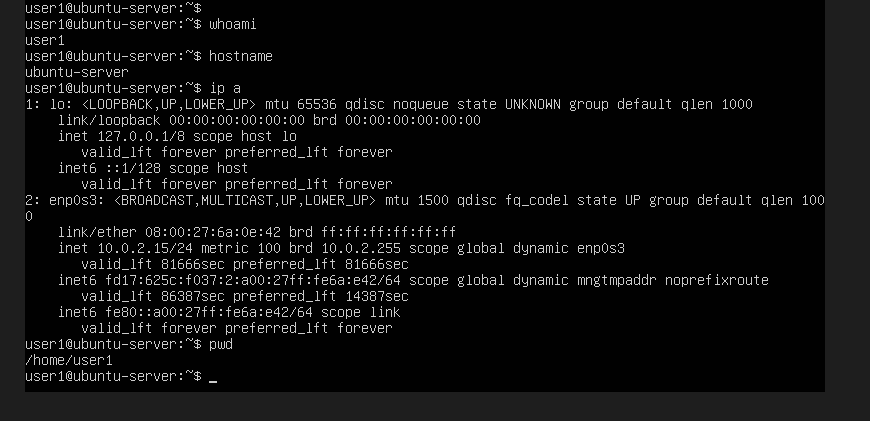
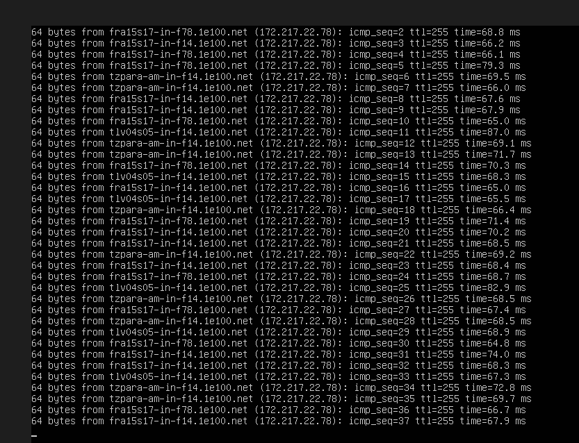
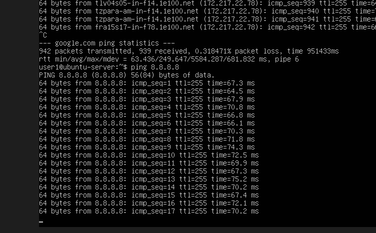

TESTS

Ubuntu est installé :

Dans le terminal Ubuntu :

1. Petits tests rapides sur le serveur, taper :

whoami      =>  Résultat :  user1

hostname      =>  Résultat :  ubuntu-server

ip a      =>  on voit :  inet 10.0.2.15   (C’est l’IP de la machine virtuelle.)

pwd      =>  Résultat :  /home/user1

2. Test réseau

Depuis Linux :

ping google.com

continue indéfiniment tant que l'on ne l’arrêtes pas manuellement.
=> faire ctrl C

3. Test DNS
ping 8.8.8.8

continue indéfiniment tant que l'on ne l’arrêtes pas manuellement.
=> faire ctrl C

