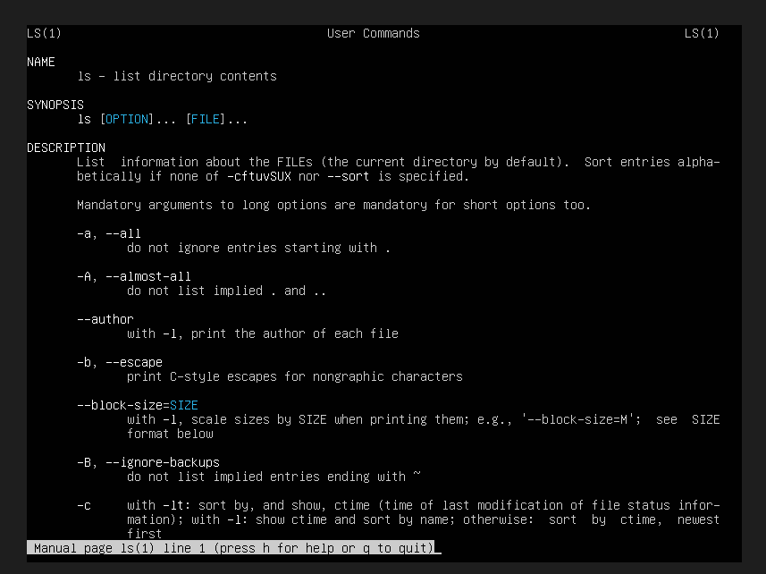

Commandes fondamentales

* voir le dossier actuel
pwd

* voir les fichiers
ls

* voir avec détails
ls -l

* changer de dossier
cd nom_dossier

* aller dans le dossier home
cd ~

* créer un dossier
mkdir nom_dossier(ex labo-linux)

* entrer dans le dossier
cd nom_dossier(ex labo-linux)

* créer des fichiers
touch test1.txt
touch test2.txt

* afficher les fichiers
ls

-------

* voir le username
whoami

* voir le nom du serveur 
hostname

* voir l'adresse ip
ip a

-------------

commandes Linux indispensables

1. sudo (ULTRA IMPORTANT)
Sert á Exécuter une commande en tant qu’administrateur (root).

Exemple
    sudo apt update
met à jour la liste des paquets

c’est important car Linux est sécurisé :
utilisateur normal → limité
admin (root) → contrôle total

=> sudo permet de faire des actions sensibles en sécurité

2. apt (gestion des logiciels)
sert á Installer / supprimer des programmes.

Exemples :
Mettre à jour
    sudo apt update
    sudo apt upgrade
Installer un outil
    sudo apt install htop
    htop = voir les processus (comme gestionnaire des tâches, une fois installé pour le lancer taper juste htop)
Supprimer
    sudo apt remove htop

3. man (notre meilleur ami)
sert á Voir la documentation d’une commande.

Exemple
man ls
    explique toutes les options de ls

attention man cd par exemple ne fonctionnera pas car c'est une commande interne du bash pas un exécutable.
On peut regarder tout ce qui possède une page de manuel, c’est‑à‑dire principalement :

des programmes (ls, grep, ssh…)

des fichiers de configuration (fstab, crontab…)

des appels système (open, read…)

des bibliothèques (printf, malloc…)

des protocoles (tcp, http…)

des conventions (filesystem hierarchy, standards POSIX…)

Mais pas les commandes internes du shell comme cd, echo, alias, etc.

Ce que man peut afficher (grandes catégories) :

Programmes utilisateur
Exemples : man ls, man grep, man ssh

Appels système 
Exemples : man open, man fork

Fonctions de bibliothèque
Exemples : man printf, man malloc

Fichiers spéciaux 
Exemples : man tty, man null

Fichiers de configuration 
Exemples : man fstab, man crontab

Commandes d’administration 
Exemples : man systemctl, man ip

Pourquoi certaines commandes n’ont pas de man : Parce qu’elles sont des builtins du shell.
Pour celles‑ci, il faut utiliser :

help cd
help echo
help export

ou lire la page du shell :

man bash

Astuce utile : On peut savoir si une commande est un builtin ou un programme avec :

type cd
type ls

Comment lire une page man efficacement :

1) Structure générale d’une page man
La plupart des pages suivent ce format :

NAME — nom de la commande + courte description

SYNOPSIS — comment l’utiliser (syntaxe)

DESCRIPTION — explication détaillée

OPTIONS — liste des options (-a, --help, etc.)

EXAMPLES — exemples d’utilisation

SEE ALSO — pages liées

Chaque section est un bon point d’entrée selon ce que tu cherches.

Les sections les plus utiles
* SYNOPSIS  
Pour comprendre la syntaxe exacte.
Exemple :

ls [OPTION]... [FILE]...

* OPTIONS  
Pour voir ce que fait chaque option.
Exemple : -l pour le format long, -a pour afficher les fichiers cachés.

* EXAMPLES  
Quand on veut juste voir comment utiliser la commande dans la vraie vie.

Astuce : naviguer dans man
/mot → chercher un mot

n → aller au résultat suivant

q → quitter

h → aide interne

Trouver la bonne page quand il y en a plusieurs
Certaines commandes existent dans plusieurs sections.
Exemple : man 2 open (appel système) vs man 3 open (fonction C).

On peur lister toutes les pages disponibles :

man -a open

Exemple concret : lire man ls
Essayer :

man ls

Puis regarder :

NAME → résumé

OPTIONS → toutes les options utiles

EXAMPLES → cas pratiques

-----  

Autres commandes interessantes
Quitter
    q

history (affiche toutes tes commandes précédentes)
    history

clear (nettoie le terminal)
    clear

htop (gestionnaire des tâches - après installation de htop)
    htop