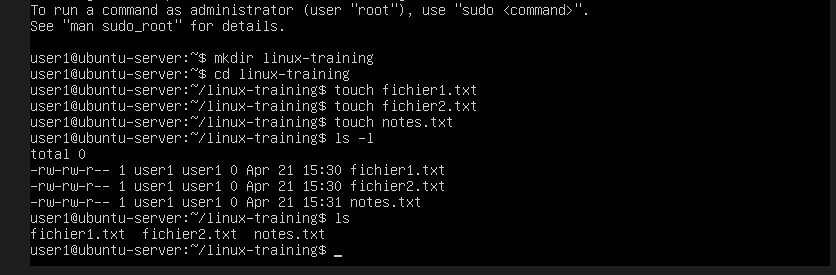
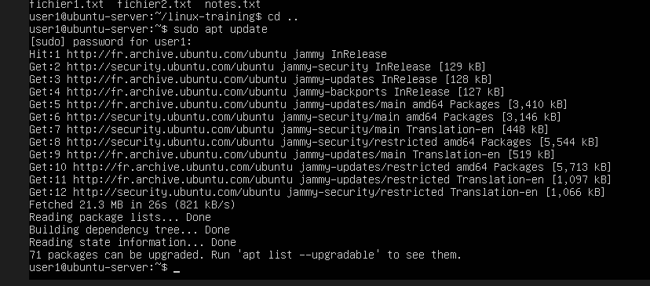
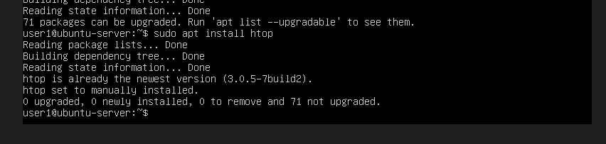
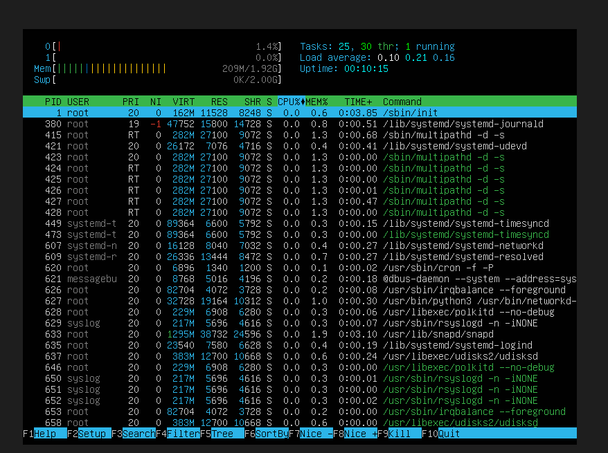
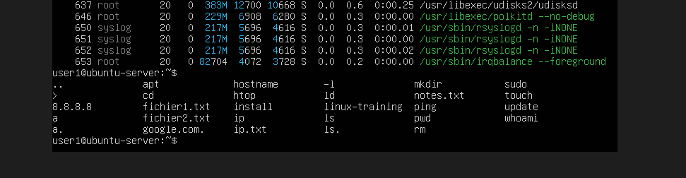
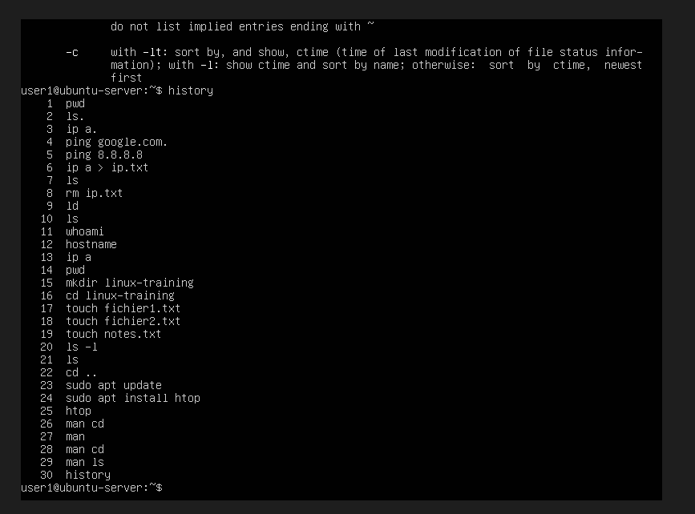

Exercices

Sur le serveur :

* Exercice 1

Créer :

mkdir linux-training

* Exercice 2

Entrer dedans :

cd linux-training

* Exercice 3

Créer :

touch fichier1.txt
touch fichier2.txt
touch notes.txt

* Exercice 4

Lister les fichiers avec détails:

ls -l

* Exercice 5

Lister les fichiers :

ls

-----------------

EXERCICES (important)

Sur le serveur :

* Exercice 1

Mettre à jour le système :

sudo apt update

* Exercice 2

Installer htop :

sudo apt install htop

Puis lancer :

htop

* Exercice 3

Afficher l’aide de ls :

man ls

* Exercice 4

Afficher l'historique :

history

