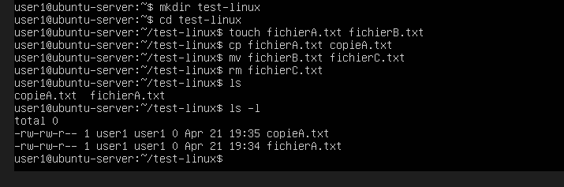

EXERCICES

1. Exercice 1

Créer :

mkdir test-linux
cd test-linux

2. Exercice 2

Créer :

touch fichierA.txt fichierB.txt

3. Exercice 3

Copier :

cp fichierA.txt copieA.txt

4. Exercice 4

Renommer :

mv fichierB.txt fichierC.txt

5. Exercice 5

Supprimer :

rm fichierC.txt

6. Visialisation

