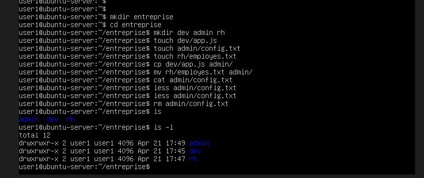
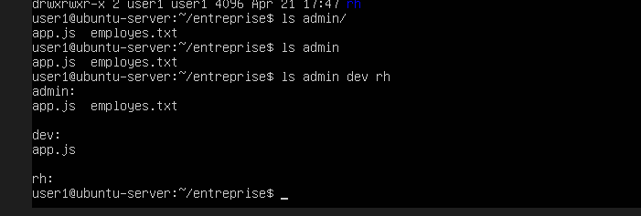

LABO — Simulation entreprise

On va simuler une structure comme en entreprise.

1. Étape 1

Créer un dossier :

mkdir entreprise
cd entreprise
2. Étape 2

Créer des dossiers :

mkdir dev admin rh

3. Étape 3

Créer des fichiers :

touch dev/app.js
touch admin/config.txt
touch rh/employes.txt

4. Étape 4

Copier un fichier

cp dev/app.js admin/

5. Étape 5

Déplacer un fichier

mv rh/employes.txt admin/

6. Étape 6

Lire un fichier

cat admin/config.txt

7. Étape 7

Supprimer un fichier

rm admin/config.txt

8. Visualisation des dossiers :

