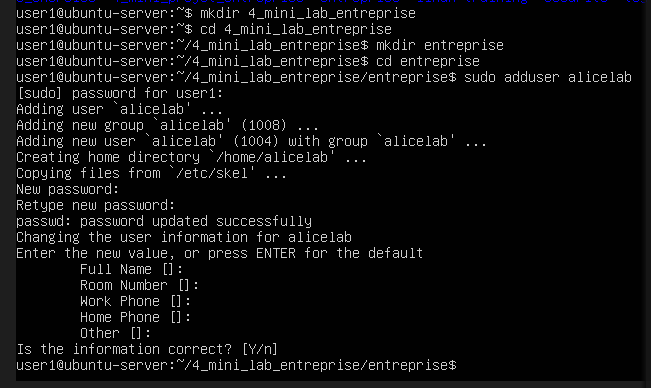
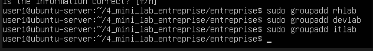
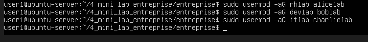
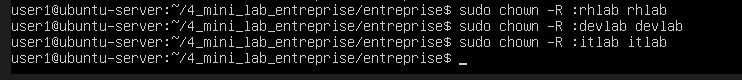
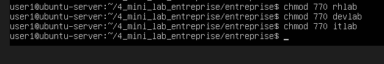
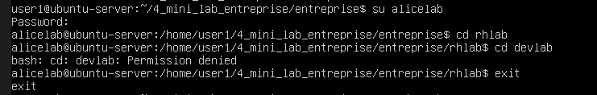
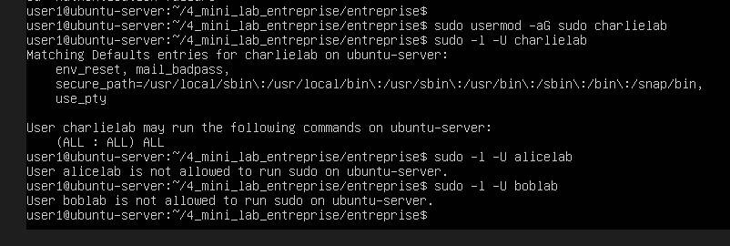

MINI LAB ENTREPRISE (niveau pro réel)

BUT : simuler 
    séparation des services
    gestion utilisateurs
    gestion groupes
    permissions fichiers
    sécurité entreprise
    logique admin système

On va simuler une vraie infra sur Ubuntu

Objectif : comprendre users + groupes + permissions + sudo

au préalable 
mkdir 4_mini_lab_entreprise
cd 4_mini_lab_entreprise
mkdir entreprise
cd entreprise

1. Structure entreprise

ENTREPRISE
├── rh
├── dev
└── it

2. Création des utilisateurs
sudo adduser alicelab   mis password alicelab123
sudo adduser boblab   mis password aboblab123
sudo adduser charlielab   mis password charlielab123

captue ecran pour alicelab mais fait idem pour les autres

3. Création des groupes
sudo groupadd rhlab
sudo groupadd devlab
sudo groupadd itlab

4. Affectation des utilisateurs
sudo usermod -aG rhlab alicelab
sudo usermod -aG devlab boblab
sudo usermod -aG itlab charlielab

5. Création des dossiers
mkdir entreprise
cd entreprise
mkdir rhlab devlab itlab

6. Sécurisation des dossiers
sudo chown -R :rhlab rhlab
sudo chown -R :devlab devlab
sudo chown -R :itlab itlab

Puis :

chmod 770 rhlab
chmod 770 devlab
chmod 770 itlab

7. Résultat logique
Dossier	accès
RH	RH uniquement
DEV	DEV uniquement
IT	IT uniquement

8. Test réel
su alicelab    (mettre mdp de alice)
cd rhlab   => OK
cd devlab  => interdit

9. Ajout sécurité sudo (IT uniquement)
sudo usermod -aG sudo charlielab
=> Charlie devient admin IT

verif avec sudo -l -U nom utilisateur

