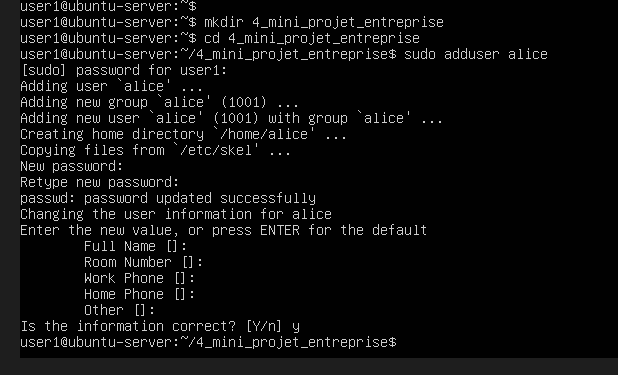
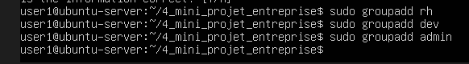
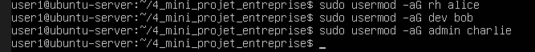
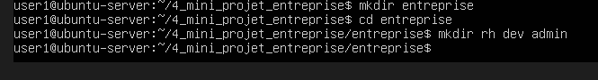
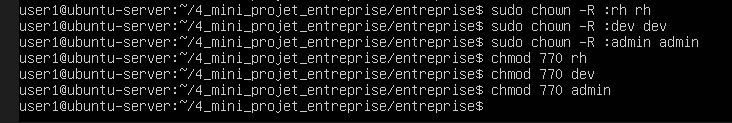
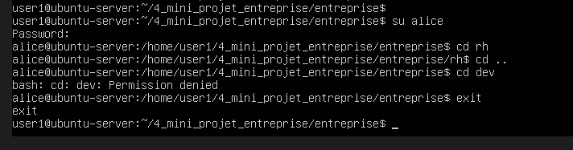
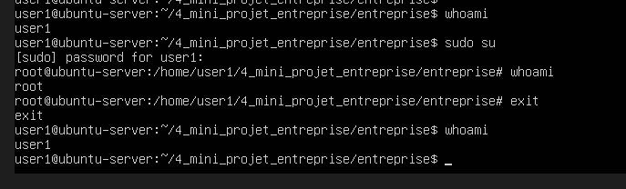

Permissions Linux (TRÈS IMPORTANT)

C'est une notion clé en entreprise : la sécurité des fichiers

Sur Ubuntu, tout est basé sur ça.

POUR PLUS DE COMMANDES CHMOD VOIR :

https://chmodcommand.com/

1. Voir les permissions

Commande :

ls -l

Exemple :

-rw-r--r-- 1 user1 user1 0 fichier.txt

2. Comprendre les permissions

-rw-r--r--

Découpage :

rw- r-- r--

Partie	Signification
  rw-	  propriétaire
  r--	  groupe
  r--	  autres

Signification
Lettre	Signification
  r	      read (lecture)
  w	      write (écriture)
  x	      execute (exécution)

3. Modifier les permissions — chmod

* Donner tous les droits :

chmod 777 fichier.txt

=> tout le monde peut :

lire
écrire
exécuter

* Donner lecture seule pour tous :

chmod 444 fichier.txt

*  Le propriétaire a les droits de lecture et écriture et Le groupe et les autres utilisateurs ont uniquement le droit de lecture.

chmod 644 fichier.txt

Exemple courant :

chmod 755 script.sh

=> utilisé pour scripts

4. Changer propriétaire — chown

sudo chown user1 fichier.txt

=> change le propriétaire

5. Pourquoi c’est important

En entreprise :

protéger les données
limiter les accès
éviter les erreurs

=> c’est une base de la cybersécurité

Question rapide

Si on voit :

-r--r--r--

que peut faire l’utilisateur sur ce fichier ?
        propriétaire : lecture seule
        groupe : lecture seule
        autres : lecture seule
Donc personne ne peut écrire ni exécuter, seulement lire.

6. Explication de chmod 755 script.sh

Sur Ubuntu, les permissions numériques fonctionnent comme ça :

7 = 4 + 2 + 1 = r + w + x

Chiffre	 Signification
    4	  lecture (r)
    2	  écriture (w)
    1	  exécution (x)

Donc 755 veut dire :

7   5   5

décomposition :

1er chiffre (propriétaire)
7 = rwx

 lire
 écrire
 exécuter

2e chiffre (groupe)
5 = r-x

 lire
X écrire
 exécuter

3e chiffre (autres)
5 = r-x

 lire
X écrire
 exécuter

Pourquoi 755 pour un script ?

Parce qu’un script :

script.sh

doit être :

 exécutable par le propriétaire
 lisible par les autres
X pas modifiable par les autres

Exemple réel
chmod 755 script.sh

Puis :

./script.sh

=> le script peut être exécuté

Comparaison simple
chmod	résultat
 644	  fichier normal (lecture seule pour les autres)
 755	  script exécutable
 777	  tout le monde peut tout faire  DANGEREUX 

* ATTENTION Le 0 est simplement la valeur numérique correspondant à aucune permission :

EX 
chmod 770, le dernier chiffre 0 signifie bien aucune permission pour “others”.

Explication rapide
Les permissions numériques sont toujours données sous la forme UGO :

U = User (propriétaire)

G = Group (groupe)

O = Others (autres)

Chaque chiffre est la somme de :

4 = lecture (r)

2 = écriture (w)

1 = exécution (x)

Donc :

7 = 4+2+1 = rwx

5 = 4+1 = r-x

0 = aucune permission

* MINI EXERCICE (pour bien comprendre)

Si on a :

chmod 700 fichier.txt

 ça veut dire quoi ?

le propriétaire peut : lire écrire exécuter
le groupe ne peut rien faire (pas d'accès)
les autres ne peuvent rien faire (pas d'accès)

7. comment donner une permission à certains utilisateurs ? ou en interdire ?

Sur Ubuntu, il y a 3 niveaux de contrôle :

# 1. Permissions classiques (chmod)

 déjà vu :

 chmod 644 fichier.txt

Mais ça ne gère que :

propriétaire
groupe
autres

ce n’est pas assez précis pour une entreprise

# 2. Gestion par utilisateurs et groupes (IMPORTANT)

C’est la méthode pro.

Idée :

On ne donne pas les droits à une personne directement
on donne les droits à un groupe

Exemple entreprise
groupe RH → accès fichier RH
groupe DEV → accès code
groupe ADMIN → tout

* Créer un groupe

    sudo groupadd dev

* Ajouter un utilisateur au groupe

    sudo usermod -aG dev user1

* Donner un dossier à un groupe

    sudo chown -R :dev dossier/

* Donner accès au groupe

    chmod 770 dossier/

* Résultat

Type	          accès
  propriétaire	   lecture + écriture + exécution
  groupe	       lecture + écriture + exécution
  autres	       aucun accès

# 3. Permissions avancées (ACL) — niveau +++

=> quand on veut donner des droits à UNE personne précise

* Exemple

    setfacl -m u:user2:r fichier.txt

  => user2 peut seulement lire

* Vérifier

    getfacl fichier.txt

* Résumé simple
Méthode	   usage
 chmod	    simple (3 niveaux)
 groups	    entreprise (pro)
 ACL	    très précis (avancé)

* Ce que l'on doit retenir (IMPORTANT)

En entreprise :

on utilise groupes
pas des permissions individuelles partout

* Mini exemple réel (très important)
RH dossier → groupe rh
DEV dossier → groupe dev

Puis :

chmod 770 rh
chmod 770 dev

confidentialité + sécurité + rigueur

=> ça = gestion des permissions + groupes

# 4 mini exercice entreprise réaliste (RH / DEV / ADMIN) avec permissions comme en vrai serveur

MINI PROJET ENTREPRISE (IMPORTANT)
✔ permissions Linux
✔ gestion utilisateurs
✔ gestion groupes
✔ sécurité serveur

On simule une vraie société sur notre serveur.

* Structure
entreprise/
 ├── rh/
 ├── dev/
 └── admin/

création dossier 4_mini_projet_entreprise
puis cd 4_mini_projet_entreprise

pour la suite mis tous les password á user123

1. Étape 1 — utilisateurs
sudo adduser alice
sudo adduser bob
sudo adduser charlie

imprim ecrqn de alice mais fait idem pour bob et charlie

2. Étape 2 — groupes
sudo groupadd rh
sudo groupadd dev
sudo groupadd admin

3. Étape 3 — assignation
sudo usermod -aG rh alice
sudo usermod -aG dev bob
sudo usermod -aG admin charlie

4. Étape 4 — dossiers
mkdir entreprise
cd entreprise

mkdir rh dev admin

5. Étape 5 — permissions
sudo chown -R :rh rh
sudo chown -R :dev dev
sudo chown -R :admin admin

Puis :

chmod 770 rh
chmod 770 dev
chmod 770 admin

=> Résultat : 

Dossier	  accès
   rh	    RH uniquement
   dev	    DEV uniquement
   admin	admin uniquement

Étape bonus (très réaliste)

Test avec :

su alice
cd rh

=> alice peut accéder à RH

Mais :

cd dev

=> refusé

EXPLICATIONS :

* su alice = changer d’utilisateur

=> on passe "dans la session" de Alice
on travailles comme si on était Alice

* Comment revenir à notre utilisateur (user1)

Méthode 1 (la plus simple)

exit

ça ramène à l’utilisateur précédent

Exemple concret
user1 → su alice -> alice -> exit -> user1

* Cas important : sudo su

Parfois on verra :

sudo su

=> ça nous transforme en super administrateur (root)

*  Pour sortir du root

exit

* Différence importante 

commande	  effet
  su alice	   devient alice
  sudo su	   devient root
  exit	       revient utilisateur précédent

* Attention importante 

Sur Ubuntu :

su -> nécessite mot de passe de l’utilisateur
sudo -> utilise notre propre mot de passe

* Petit test 

Essayer dans le serveur :

whoami

Puis :

sudo su
whoami

Puis :

exit
whoami

* Résumé simple

su alice → changer d’utilisateur
exit → revenir en arrière
sudo su → devenir admin total

# 5 suppression dún utilisateur

1. Ajouter un utilisateur et l’ajouter à un groupe
On connait déjà :

    sudo adduser alice
    sudo usermod -aG marketing alice

2. Comment retirer un utilisateur d’un groupe ?

On utilise gpasswd ou deluser selon la distribution.

* Méthode 1 (Debian/Ubuntu) — retirer du groupe

    sudo deluser alice marketing

* Méthode 2 (universelle)

    sudo gpasswd -d alice marketing

Cela n’efface pas l’utilisateur, seulement son appartenance au groupe.

3. Comment supprimer complètement un utilisateur de la société ?

En entreprise, on supprime un compte avec :

    sudo deluser alice

Mais cela ne supprime pas son dossier personnel.

Si on veut supprimer aussi son /home/alice :

    sudo deluser --remove-home alice

4. ATTENTION Est‑ce que ça pose problème si Alice est propriétaire de fichiers ?

Oui, potentiellement.

Quand on supprime un utilisateur, son UID (ex : 1003) disparaît, mais les fichiers restent avec cet UID :

    ls -l
    -rw-r--r-- 1 1003 1003  4096 rapport.txt

Le système ne “bugge” pas, mais :
    les fichiers deviennent orphelins
    personne ne sait à qui ils appartiennent
    certains services peuvent perdre des droits d’accès
    c’est un risque de sécurité si les fichiers contiennent des données sensibles

5. Que fait-on en entreprise avant de supprimer un compte ?

Bonne pratique : réassigner les fichiers à un autre utilisateur.

Exemple : 

* transférer les fichiers d’Alice à Bob :

    sudo find / -uid 1003 -exec chown bob:bob {} \;

* On peut aussi archiver son /home :

    sudo tar czf alice-archive.tar.gz /home/alice

6. Résumé clair

Action	                            Commande	                        Effet
  Retirer Alice d’un groupe	       deluser alice groupe	              Elle n’a plus les droits du groupe
  Supprimer Alice	               deluser alice	                  Le compte disparaît
  Supprimer Alice + son home	   deluser --remove-home alice	      Nettoyage complet
  Réassigner ses fichiers	       find / -uid UID -exec chown ...	  Évite les fichiers orphelins

7. Comment connaître l’UID d’un utilisateur ?

    1) 
    
    * Avec la commande id (méthode recommandée)

        id -u alice

    -> Affiche uniquement l’UID de l’utilisateur.

    Selon la documentation, id -u <username> retourne l’UID réel de l’utilisateur demandé. 

    * Pour voir aussi son GID et ses groupes :

        id alice

    2) En consultant /etc/passwd

    Chaque ligne du fichier /etc/passwd contient l’UID en 3ᵉ champ.

    Exemple :

        grep alice /etc/passwd

    Sortie typique :

        alice:x:1003:1003:Alice:/home/alice:/bin/bash

        -> 1003 = UID  
        -> 1003 = GID (groupe principal)

    Cette structure est confirmée par la documentation Linux. 

    3) Avec getent (méthode propre et portable)

        getent passwd alice

    -> Donne la même ligne que /etc/passwd, mais via la base NSS (LDAP, AD, etc.).
    Très utilisé en entreprise.

    4) Exemple complet

    Si on veut supprimer Alice et réassigner ses fichiers, on doit d’abord connaître son UID :

        id -u alice

    Supposons que la sortie soit : 1003

    Ensuite, pour retrouver tous ses fichiers :

        sudo find / -uid 1003

    Et pour les réassigner à Bob :

        sudo find / -uid 1003 -exec chown bob:bob {} \;

    5) Résumé rapide

    Besoin	                          Commande	                   Résultat
      Connaître l’UID	                 id -u alice	             UID seul
      Voir UID + GID + groupes	         id alice	                 Infos complètes
      Voir l’UID dans passwd	         grep alice /etc/passwd	     UID = 3ᵉ champ
      Méthode entreprise (LDAP/AD)	     getent passwd alice	     UID via NSS

# 6  user / sudo / root   -  pourquoi bloquer su pour la sécurité

1. Schéma simple : utilisateurs Linux
            (ROOT)
        super administrateur
              │
     ┌────────┴────────┐
     │                 │
  sudo user        su user
 (user1)           (alice)
     │
 utilisateur normal

2. Les 3 niveaux expliqués simplement

    1) User normal

        user1

    peut travailler dans ses fichiers
    ne peut pas modifier le système

    Exemple :

        ls /home

    2) sudo (user avec pouvoirs temporaires)

        sudo command

    signifie :

    "je fais une action en admin, mais temporairement"

    Exemple :

    sudo apt update

    =>  autorisé
        sécurisé
        contrôlé

    3) root (super administrateur)

        root

    c’est le niveau le plus puissant

    =>  accès à tout
        peut tout casser
        dangereux si mal utilisé

3. Différence simple

Type	  puissance	           risque
 User	   faible	            aucun
 sudo	   élevé (temporaire)	contrôlé
 root	   total	            très dangereux

4. Comment les entreprises bloquent su

Très important en entreprise.

* Pourquoi bloquer su ?

Parce que :

trop dangereux
pas traçable
mot de passe root partagé

* Solution 1 — désactiver root login

    sudo passwd -l root

=> bloque l’accès direct root

* Solution 2 — forcer sudo uniquement

Les utilisateurs doivent faire :

    sudo command

et jamais :

    su

* Solution 3 — Ajout sécurité sudo pour 1 utilisateur (par exemple ici charlie est dans un groupe IT uniquement)

    sudo usermod -aG sudo charlie

=> Charlie devient admin IT

* Solution 4 — groupe sudo

    usermod -aG sudo user1

=> seuls certains utilisateurs peuvent devenir admin

5. Pourquoi les entreprises font ça

Dans un vrai système :

sécurité
traçabilité
éviter erreurs critiques

=> tout passe par sudo uniquement

* Exemple réel entreprise
user1 → sudo OK
alice → sudo OK
root direct → interdit

6. Résumé ultra simple
user normal = travail simple
sudo = admin temporaire
root = dieu du système (dangereux)

* Mini test 

    * Pourquoi sudo est plus sécurisé que root direct ?
    Sudo est plus sécurisé que Root car temporaire
    sudo est aussi journalisé (logs)
    on sait qui a fait quoi
    contrairement à su qui est plus “opaque”

    * Que fait cette commande ?    sudo passwd -l root
    La commande empêcher de devenir root
    ça verrouille le compte root
    donc plus de login direct root possible

7. Pour réactiver le compte root après un passwd -l root, il suffit d’utiliser passwd -u root, qui déverrouille le compte.

    1) Ce que fait réellement passwd -l root
    La commande :

        sudo passwd -l root

    verrouille le compte root en ajoutant un ! devant son hash dans /etc/shadow.
    Cela empêche toute authentification par mot de passe, donc root ne peut plus se connecter (ni en console, ni en SSH).

    ATTENTION  Le compte n’est pas supprimé : il est juste verrouillé.

    2) Comment faire machine arrière ?
    Pour réactiver le compte root :

        sudo passwd -u root

    L’option -u = unlock enlève le ! dans /etc/shadow et restaure la possibilité de se connecter avec le mot de passe root.

    3) Et si on veut aussi redéfinir un mot de passe ?
    On peut ensuite définir un nouveau mot de passe root :

        sudo passwd root

    4) Résumé clair

    Action	                        Commande	             Effet
     Verrouiller root	             sudo passwd -l root	  Désactive l’authentification root
     Déverrouiller root	             sudo passwd -u root	  Réactive le compte root
     Changer le mot de passe root	 sudo passwd root	      Définit un nouveau mot de passe

    

8. Si on bloque su comment on change-t-on d'utilisateur ?

Réponse simple

Même si su est bloqué :

    1) On ne change PAS vers root directement

    => on utilise :

        sudo -i
    ou
        sudo su -

    2) On change vers un autre utilisateur (si autorisé)

        sudo -u alice bash

    ça veut dire :

    “je lance un shell en tant que alice”

    3) Mais en entreprise réelle

    On évite de “switcher” souvent.
    on travaille comme ça :
        user1 fait son travail
        sudo pour actions admin
        pas de changement constant d’utilisateur

    * Schéma logique entreprise

        user normal
        │
        ├── sudo (actions admin ponctuelles)
        │
        └── sudo -i (admin temporaire si besoin)

    * Pourquoi on bloque su en entreprise ?
        Sur Ubuntu :
            éviter les connexions root directes
            garder des logs propres
            éviter les erreurs graves
            forcer l’usage de sudo

8. Comment devenir un autre utilisateur si su est bloqué ?
Il existe deux méthodes courantes :

* Méthode 1 : sudo configuré pour permettre le changement d’utilisateur

On autorise certains utilisateurs à exécuter :

    sudo -u alice -i

Cela remplace :

    su alice

C’est la méthode la plus utilisée, car elle permet un contrôle fin via /etc/sudoers.
On peut même autoriser uniquement certains comptes à changer vers certains autres comptes. 

* Méthode 2 : restreindre su à un groupe spécifique

On ne bloque pas totalement su, mais on limite son usage à un groupe (ex : wheel ou adminmembers).
Seuls les membres de ce groupe peuvent faire :

    su alice

Les autres auront un refus. 

* Résumé clair
su est souvent bloqué pour éviter les escalades de privilèges.

Pour devenir un autre utilisateur :

sudo -u alice -i si configuré

ou autoriser su uniquement à un groupe dédié

8. signifiCATION DU u et du i dans sudo -u alice -i

Signification détaillée

 *   sudo -u alice

L’option -u signifie “run as user”.
Elle permet d’exécuter une commande en tant qu’un autre utilisateur que root.

Exemple :

    sudo -u alice whoami

-> affiche alice.

Selon la documentation, sudo permet d’exécuter un programme avec les privilèges d’un autre utilisateur, pas seulement root. 

 *    sudo -i

L’option -i signifie “simulate initial login”.

Elle ouvre un shell de login, c’est‑à‑dire :

    charge les variables d’environnement de l’utilisateur cible

    lit ses fichiers de configuration (~/.profile, ~/.bash_profile, etc.)

    se comporte comme si l’utilisateur venait de se connecter physiquement

C’est l’équivalent de :

    su - alice

mais en version sudo.

* Exemple complet

    sudo -u alice -i

-> on devient alice, avec son environnement complet, comme si elle venait de se connecter.

* Pourquoi utiliser -i ?

Sans -i, on obtient juste un shell minimal avec l’identité de l’utilisateur, mais pas son environnement.

Avec -i, on obtient :

    son $HOME
    son $PATH
    ses alias
    ses variables d’environnement
    ses fichiers de configuration de login

C’est indispensable pour tester un compte ou déboguer un problème utilisateur.

* Résumé
Option	       Signification	  Effet
 -u alice	    Run as user	       Exécute la commande en tant que alice
 -i	            Login shell	       Charge l’environnement complet de l’utilisateur

9. Voir les permissions

La manière la plus fiable de “voir les permissions d’un utilisateur” en Linux est de vérifier : (1) son identité et ses groupes (id), (2) les permissions des fichiers (ls -l, stat), et (3) ses droits sudo (sudo -l).  
Ces trois éléments ensemble définissent réellement ce qu’un utilisateur peut faire. 

* Ce que signifie “voir les permissions d’un utilisateur”
En Linux, un utilisateur n’a pas des permissions globales comme sous Windows.
Ses permissions dépendent de trois choses :

Son UID, GID et ses groupes → ce qu’il est

Les permissions des fichiers/dossiers → ce à quoi il peut accéder

Ses droits sudo → ce qu’il peut exécuter avec élévation

Pour obtenir une vision complète, il faut donc combiner plusieurs commandes.

    1) Voir l’identité et les groupes d’un utilisateur
    Les groupes déterminent une grande partie de ses permissions.

    * id utilisateur

        id alice

    -> Affiche UID, GID, et tous les groupes.
    (Méthode recommandée pour comprendre le contexte de permissions.) 

    * groups utilisateur

        groups alice

    -> Liste uniquement les groupes. 

    2) Voir les permissions sur les fichiers/dossiers
    Les permissions sont définies par fichier, pas par utilisateur.

    * ls -l

        ls -l /chemin/fichier

    -> Montre les permissions rwx pour User / Group / Others. 

    * stat

        stat fichier

    -> Donne les permissions complètes, y compris en octal (ex : 755).
    Très utile pour les audits. 

    3) Voir les permissions sudo d’un utilisateur
    Pour savoir si un utilisateur peut exécuter des commandes administrateur :

    * sudo -l

        sudo -l -U alice
    -> Liste toutes les commandes que alice peut exécuter via sudo.
    (Méthode standard pour vérifier les droits d’administration.)

    4) Voir les permissions “système” d’un utilisateur
    Linux n’a pas de panneau “droits système” comme Windows.
    La meilleure approximation est :

        getent passwd alice  

    -> Montre UID, GID, shell, home.

        getent group  

    -> Montre les groupes et leurs membres. 

    5) Tableau récapitulatif

       Besoin	                      Commande	             Ce que ça montre
        Identité + groupes	            id alice	           UID, GID, groupes
        Groupes seuls	                groups alice	       Appartenance aux groupes
        Permissions d’un fichier	    ls -l fichier	       rwx U/G/O
        Permissions détaillées	        stat fichier	       Permissions octales
        Droits sudo	                    sudo -l -U alice	   Commandes autorisées
        Infos NSS (LDAP/AD)	            getent passwd alice	   Infos centralisées

# 7  changement du mot de passe

Comment changer son mot de passe si su est bloqué ?

* Chaque utilisateur peut changer son propre mot de passe sans su :

     passwd

Cela ne nécessite aucun privilège particulier.

* Pour changer le mot de passe d’un autre utilisateur, il faut des privilèges administrateur :

     sudo passwd alice

C’est exactement ce que recommande la documentation : utiliser sudo plutôt que su pour les opérations administratives. 

* Résumé :

Pour changer un mot de passe :

passwd pour changer son propre mot de passe

sudo passwd alice pour changer celui d’un autre utilisateur

# 8  Mini système entreprise (comme en vrai)

On simule une société :

utilisateurs
    user1 (IT)
    alice (RH)
    bob (DEV)

groupes
    sudo groupadd it
    sudo groupadd rh
    sudo groupadd dev

assignation
    sudo usermod -aG it user1
    sudo usermod -aG rh alice
    sudo usermod -aG dev bob

règles entreprise
    - user = accès limité
    - sudo = actions admin contrôlées
    - root = interdit direct

bloquer root direct
    sudo passwd -l root

test entreprise
    sudo -u alice whoami
    => affiche :
        alice

* question complémentaire 

pourquoi en entreprise on préfère utiliser sudo -i plutôt que su ?

sudo = traçable dans les logs
sudo = contrôlé par des droits (sudoers)
sudo = limité dans le temps / à une commande
su = contournement possible des règles de sécurité

Donc en entreprise : on impose sudo pour sécurité + audit + contrôle