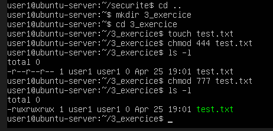

EXERCICES

ai fait dossier 3_exercice

1. Exercice 1

Créer :

touch test.txt

2. Exercice 2

Mettre :

chmod 444 test.txt

3. Exercice 3

Mettre :

chmod 777 test.txt

4. Exercice 4

Afficher :

ls -l

