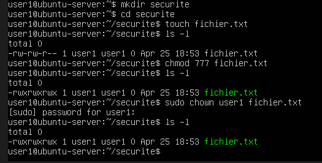

LABO — Permissions

1. Étape 1

Créer :

mkdir securite
cd securite
touch fichier.txt

2. Étape 2

Voir permissions :

ls -l

3. Étape 3

Changer permissions :

chmod 777 fichier.txt

4. Étape 4

Changer propriétaire :

sudo chown user1 fichier.txt

