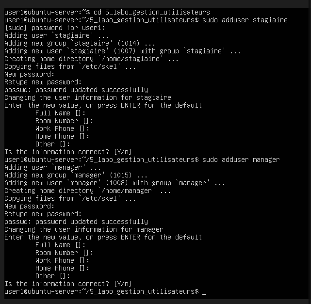
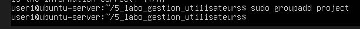
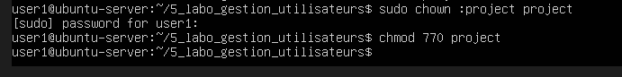
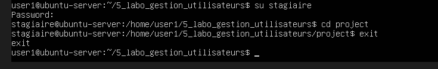

LABO — Gestion utilisateurs complète

Ce que l'on apprend ici :

    gestion comptes
    gestion équipes
    sécurité accès
    organisation entreprise

Au prealable création dossier 
    mkdir linux 5_labo_gestion_utilisateurs
    cd linux 5_labo_gestion_utilisateurs

1. Étape 1 — créer utilisateurs
    sudo adduser stagiaire
        (mis mdp stagiaire123 pour les tests)
    sudo adduser manager
        (mis mdp manager123 pour les test)

    

2. Étape 2 — créer groupes
    sudo groupadd projet

    

3. Étape 3 — assigner
    sudo usermod -aG projet stagiaire
    sudo usermod -aG projet manager

    

4. Étape 4 — créer dossier
    mkdir projet

    

5. Étape 5 — permissions
    en premier on rend propriétaire du dossier project le groupe project
    sudo chown :projet projet
    chmod 770 projet

    

6. Étape 6 — test
    su stagiaire     mdp du stagiaire
    cd projet

    

    

